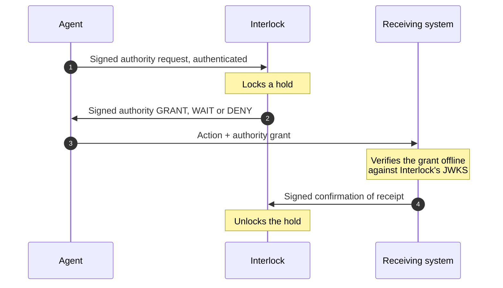

# Agent Interlock

**An independent authority that stops AI agents taking conflicting actions.**

> Identity says who. Interlock says when.

`X.509` · `SPIFFE` · `OAuth 2.0` · `API key`

Status: **Pending General Availability**

---

## The problem

Your agents act on their own — some you built, some you bought — and two of them can reach the
same listing, order or customer record through different systems. No component owns that
collision. Interlock does.

Before an agent acts on a shared resource it asks Interlock, which checks two things, in order:

1. **Who is asking** — the agent's own identity, proved the way your estate already proves it.
2. **When it may act** — is the resource free right now, or held under another agent's grant?

One agent holds a resource at a time, whichever agent asks and whichever route it comes by. If a
resource is really several of something — four bays, ten concurrent calls — you set the capacity,
and that many grants may be held at once.

The answer is a signed grant or a signed refusal, bound to the asking agent's identity. Both
sides keep the same record.

## Where Interlock sits

| Layer | Question | Owner |
|---|---|---|
| Identity | Who are you? | **Yours** — PKI, SPIFFE or IdP |
| Access control | Are you allowed to reach this at all? | **Yours** — IAM or policy engine |
| **Authority** | **Given what is happening right now, may you act?** | **Ours — Agent Interlock** |
| Workflow | What happens next — which agent, in what order? | **Yours** — orchestrator or agent framework |

Interlock is not an identity provider, not an access-control system and not a workflow engine,
and it replaces none of the ones you run. It never starts anything and never calls an agent back.
It answers one question, at the moment an agent asks.

## Why not just a lock?

If every agent lives in one application over one database, use the database's locks. You do not
need Interlock.

The problem starts when they don't: agents from different teams, frameworks and vendors reaching
the same records, with no single arbiter they all trust and all actually call.

| A row lock, a Redis key, a queue — where it stops | Interlock — consider it when |
|---|---|
| Works only where you own the code. A bought agent cannot take a row lock in your database or a key in your Redis. | Agents from more than one team, framework or vendor act on the same records. |
| The holder is a session or a random token, not a proven identity. | Agents have already collided, and a customer saw the result. |
| Leaves no signed record another system can verify. Building one means running your own lock service and distributing its keys. | You need proof of which agent was allowed to act, on what and when. |

## How it works

Identity and authority are separate chains of trust. Interlock adds the second.

### Who is asking

One endpoint accepts all four:

| Method | How it is proved |
|---|---|
| X.509 | A certificate from your own PKI, with or without mTLS |
| SPIFFE | An SVID from your trust domain, verified against the bundle you publish. Interlock verifies SVIDs; it never issues them |
| OAuth 2.0 | Client credentials |
| API key | A registered key |

Where an agent has nothing yet, Interlock issues it a certificate, client credentials or an API
key, so nothing waits on PKI. The decision is the same whichever method is presented; only the
strength of the binding is recorded.

### When it may act

| Answer | Meaning | What the agent does |
|---|---|---|
| **GRANT** | A short-lived signed JWT to act now on the named resources | Present it to the receiving system |
| **WAIT** | Signed *not yet*, with a retry time | Honour the retry time, then ask again |
| **DENY** | Signed *no* | Stop. It is an answer, not an error |

While a grant holds, any other agent asking for the same limited resources waits or is refused.

### Verifying a grant

The receiving system verifies the grant itself. Interlock is not called at action time, and the
action runs directly between your systems.

- Signature checks against Interlock's published keys (JWKS). Signing is `ES256` or `RS256`.
- `typ` is `interlock-authority+jwt`. Every Interlock JWT is explicitly typed (RFC 8725), so one
  kind cannot stand in for another.
- `cnf` is always present and binds the grant to the asker: `x5t#S256` for a client certificate
  (RFC 8705), `jkt` for a published key (RFC 7638), or `kid` for a registered secret. A grant that
  leaks is a grant that fails.
- `exp` is seconds to minutes. A long-lived grant is a booking, which is a different product.

### Closed loop, not grant and forget

A grant locks every resource on the route together. The lock is released only when the receiving
side confirms receipt back to Interlock — the final receiver by default, or each step as it
clears. No agent frees a resource for itself. If no confirmation arrives, the hold stands and an
operator is alerted; a timed release is your choice, never the default.

## Interface

- HTTPS and JSON, specified in OpenAPI.
- Every request and response body is signed as a JWS.
- Non-public calls carry an OAuth 2.0 access token bound to the caller's credential: a
  certificate thumbprint over mTLS, or a DPoP key (RFC 9449).
- Built on published standards only: JWT (RFC 7519), JWS (RFC 7515), JWK thumbprints (RFC 7638),
  `cnf` (RFC 7800), certificate-bound tokens (RFC 8705), JWT best practice (RFC 8725), X.509,
  SPIFFE.

## Coming soon

Interlock is currently in **pre-release development**.

The hosted service, documentation, SDKs and integration examples will be published here at general availability.

**Follow this organization for the GA release.**

> **Identity says who. Interlock says when.**

---

© 2026 Agent Interlock · [agent-interlock.co.uk](https://agent-interlock.co.uk/) · [Privacy](https://agent-interlock.co.uk/privacy.html)

